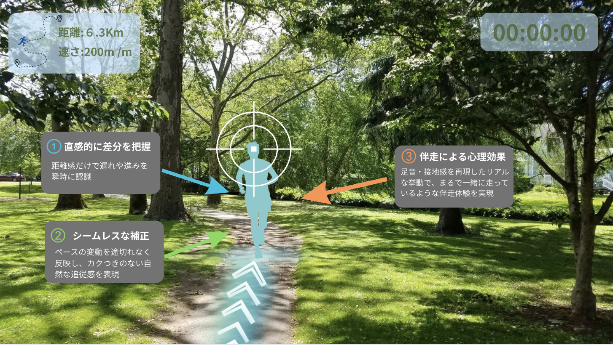
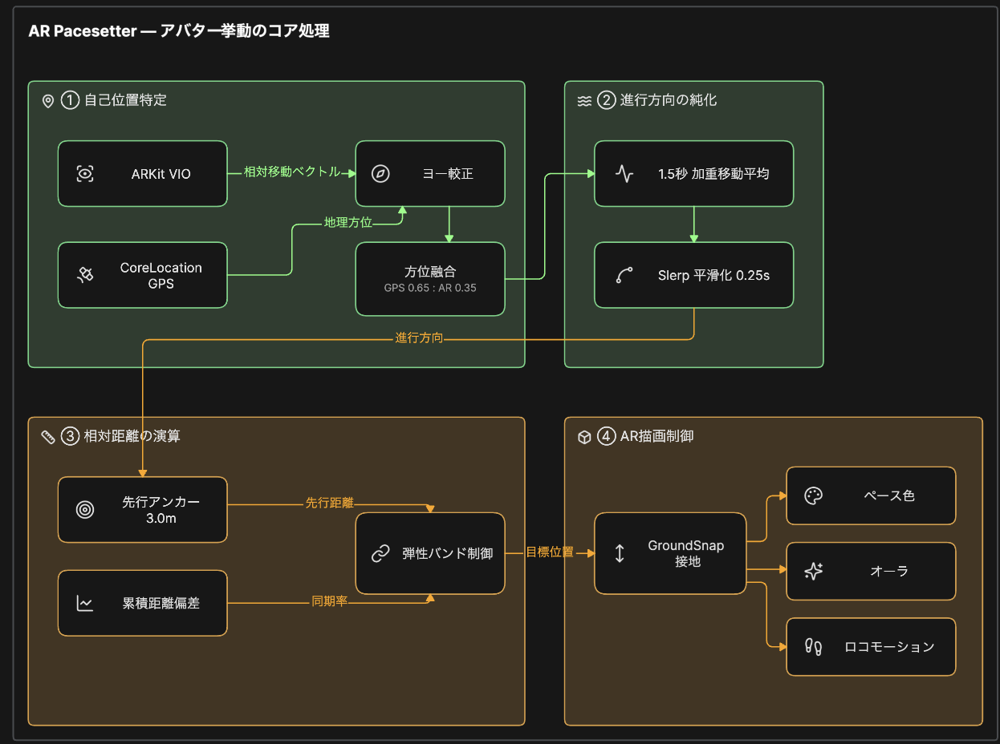
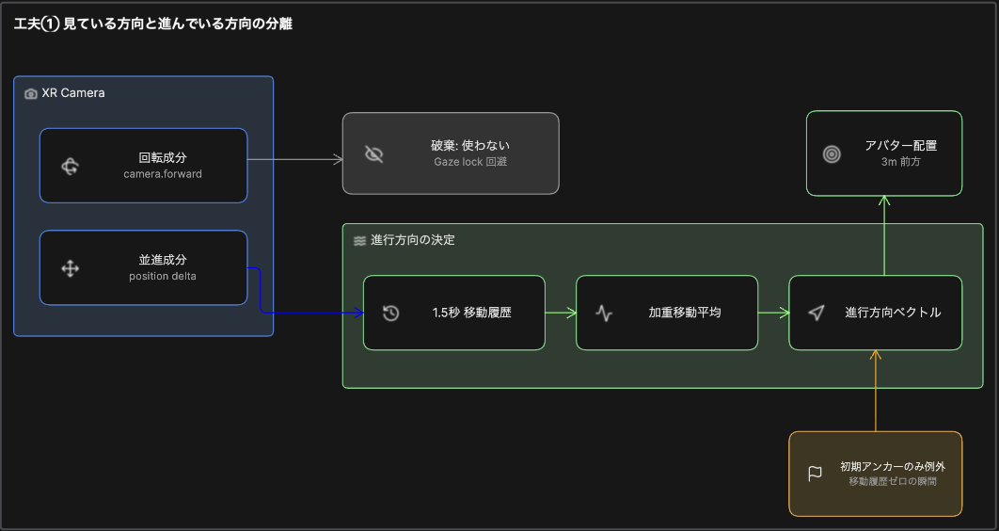
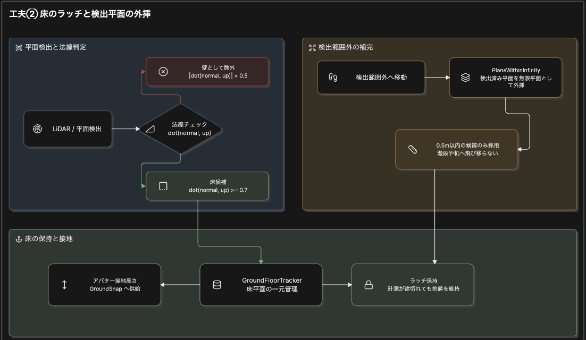

- バージョン：v3
- 作成日：2026-09-10
- 開発方式：アジャイル
- ステータス：v2の内容を引き継ぎ、UaaL統合アーキテクチャとアバター挙動のコア処理アルゴリズムを反映

---

## 1. 概要

本文書は、要件定義書（ARグラス側）で定義した機能を、どのような構成要素・役割分担で実現するかを示すものである。

- 技術選定は今後変わる可能性があり、内容は随時更新する
- 粒度は基本的に粗めに留める方針だが、本バージョン（v3）では、実装チームがすでに設計・検証済みのアルゴリズム（アバター挙動のコア処理）について、参照元の図（Eraser）をもとに文章化・表化して記載している（5章）。これは例外的な扱いであり、今後変更される可能性がある点に変わりはない

---

## 2. システム構成（役割分担）

※ この構成は現時点（2026年9月時点）の方向性であり、今後大幅に変わる可能性がある。

### 2.1 統合アーキテクチャ（UaaL）

iPhone・ARグラスの2台構成だが、ソフトウェアとしては**1つのiPhoneアプリに統合**されている（UaaL＝Unity as a Library）。

- **SwiftUIホスト層**：GPS・HealthKit・UI・画面遷移・ログ出力を担当（要件定義書における「スマホアプリ側」に相当）
- **Unity層**：Unity 6 + URP / AR Foundation（ARKit）による、3m前方アバターとHUDの描画・追従を担当（要件定義書における「ARグラス側」表示内容に相当）
- **接合部**：SwiftUIとUnityは、1つのXcodeワークスペース内でObjective-C++ブリッジを介して双方向通信する

### 2.2 ARグラス（ハードウェア）

- **表示専用**。USB-C有線・DisplayPort Alt Modeで、無圧縮1080p/60fpsの映像を受信するのみ
- 専用SDKには依存しない（iOS標準の外部ディスプレイAPIで出力するため、グラスの機種依存を排除できる）
- **処理はすべてiPhone内で完結する**。グラス側にロジック・通信処理は存在しない

### 2.3 動作環境

- iPhone 12 Pro以上 ／ iOS 26以上
- 60fps・Motion-to-Photon 20ms以内

### 2.4 品質を守る仕組み（実機なしで回る検証）

| 手段 | 内容 |
|---|---|
| dotnet test | 純ロジックのユニットテスト（Unity起動不要・数秒で完了） |
| Unityヘッドレス E2E | コマンド一発で全シナリオを回帰検証 |
| GitHub Actions | macOSランナーで署名なしiOSビルド検証（実機を借りずに確認） |

---

## 3. 機能ごとの対応（要件定義書 4章対応）

| 機能 | 実現方法 |
|---|---|
| 4.1 アバター表示・追従 | ARKitによる計測結果をもとに、Unity上で3Dアバターの描画・動きの物理演算を行う（詳細ロジックは5章参照） |
| 4.2 AR HUD | Unity上でUI要素として描画する |
| 4.3 セーフティ | 検知ロジックの実装場所は未確定 |
| 4.4 サウンド | 再生方法は未確定（Unity内で完結させるか検討中） |
| 4.5 走行分析（表示のみ） | スマホアプリから受け取った結果をUnity側で表示する |

---

## 4. AR HUD レイアウト・アバター表現（モック画像ベース）

モック画像をもとに、AR視界内の具体的な配置を定義する。色合いは仮のものであり、今後デザインフェーズで確定する。

### 4.1 AR HUD レイアウト

| 配置 | 表示内容 |
|---|---|
| 左上 | 距離・ペース（速さ）の情報カード |
| 右上 | 経過タイム |

### 4.2 アバター表現

- 半透明の人型アバターとして表示する
- アバターの足元に、**アバターが通過したルートの軌跡**をシェブロン（矢印型マーク）で表示する

### 4.3 モック画像に含まれるが、設計対象外の要素

以下はモック画像内で人間（説明を読む側）向けに付けた注釈であり、実際のAR HUD/アバターのデザインには含まれない。

- 中央のロックオン風リング（ターゲットマーク）：「ユーザーがここを見ている」ことを示すための説明用マークであり、実装対象ではない
- ①②③の吹き出し説明：設計コンセプトの補足説明であり、実際のHUDには表示しない

---

## 5. アバター挙動のコア処理

参照元：実装チーム作成の図（Eraser：「AR Pacesetter — アバター挙動のコア処理」「工夫①見ている方向と進んでいる方向の分離」「工夫②床のラッチと検出平面の外挿」）

### 5.1 全体像

処理は大きく4ブロックで構成される。

| ブロック | 役割 |
|---|---|
| ①自己位置特定 | ARKitとGPSから、ユーザーの移動・方位情報を取得する |
| ②進行方向の純化 | ①の出力を平滑化し、なめらかな進行方向を算出する |
| ③相対距離の演算 | アバターとユーザーの相対位置を算出する |
| ④AR描画制御 | ③の結果を、実際のアバター描画・演出に反映する |

### 5.2 ①自己位置特定

- **ARKit VIO**：相対移動ベクトルを取得し、ヨー較正に用いる
- **CoreLocation GPS**：地理方位を取得し、ヨー較正結果と合わせて方位融合を行う
- **方位融合の比率**：GPS 0.65 : AR 0.35
- 融合結果は「進行方向」として③（相対距離の演算）へ渡される

### 5.3 ②進行方向の純化

- **1.5秒 加重移動平均**：進行方向の急な変化を平滑化する
- **Slerp平滑化（0.25秒）**：球面線形補間により、0.25秒かけてなめらかに反映する

### 5.4 ③相対距離の演算

- **先行アンカー**：アバターは常にユーザーの3.0m前方を目標位置とする
- **累積距離偏差**：ユーザーとの同期率（ペース差の蓄積）を算出する
- **弾性バンド制御**：先行距離と同期率をもとに、ゴムのような追従感で目標位置を算出する

### 5.5 ④AR描画制御

- **GroundSnap接地**：算出した目標位置を、実際の地面の高さに接地させる
- 接地結果は、以下の表現に反映される
  - **ペース色**：ペースに応じてアバターの発光色を変化させる
  - **オーラ**：視覚エフェクト
  - **ロコモーション**：歩行・走行モーションの切り替え

### 5.6 工夫①：見ている方向と進んでいる方向の分離

**課題**：素朴に実装すると、カメラの回転成分（camera.forward）を進行方向として使いたくなるが、それをすると頭を横に振った瞬間にアバターが視界外に飛んでしまう（Gaze lock問題）。

**対応**：

- XR Cameraから取得できる2要素のうち、**回転成分（camera.forward）は破棄**する（Gaze lock回避）
- **並進成分（position delta）のみ**を使用し、以下の流れで進行方向ベクトルを算出する
  1. 1.5秒分の移動履歴を蓄積
  2. 加重移動平均を算出
  3. 進行方向ベクトルとして確定し、アバターを3m前方に配置する

**例外**：移動履歴がゼロの瞬間（起動直後など）は、初期アンカーのみを用いて進行方向ベクトルを決定する。

### 5.7 工夫②：床のラッチと検出平面の外挿

**平面検出と法線判定**

- LiDARによる平面検出結果に対し、法線チェック `dot(normal, up)` を行う
- `|dot(normal, up)| > 0.5` の場合：壁として除外する
- `dot(normal, up) >= 0.7` の場合：床候補として採用する

**検出範囲外の補完**

- 検出済み平面の範囲外にユーザーが移動した場合、その平面を無限平面として外挿する（PlaneWithinInfinity）
- ただし、外挿候補は**0.5m以内のもののみ採用**する（階段や机など、別の高さの面に誤って飛び移らないようにするため）

**床の保持と接地**

- 床候補・外挿候補は、**GroundFloorTracker**（床平面の一元管理）に集約される
- **ラッチ保持**：計測が一時的に途切れても、直前の値を維持する
- 最終的にアバターの接地高さとして、GroundSnapへ供給される

---

## 6. 未確定事項

- 危険検知（信号・交差点など）の判定ロジックをどこで実装するか

※ 「スマホアプリとARグラス間の通信方式」は、UaaL構成により1アプリ内のブリッジ通信に統合されることが判明したため解消（2.1参照）。
※ 「座標計算・追従判定の詳細な処理内容」は、5章にて反映済みのため解消。

---

## 7. 改訂履歴

| バージョン | 日付 | 変更内容 |
|---|---|---|
| v1 | 2026-09-04 | 初版作成。Unity（C#）＋ARKitの構成と、機能ごとの粗い役割分担を確定 |
| v2 | 2026-09-10 | モック画像をもとに、AR HUDレイアウト（左上：距離・ペース／右上：タイム）とアバター表現（半透明の人型＋通過ルートのシェブロン表示）を追加。ロックオン風リング・吹き出し説明は設計対象外と明記 |
| v3 | 2026-09-10 | システム構成をUaaL統合アーキテクチャ（SwiftUI＋Unity、ARグラスは表示専用）に全面更新。アバター挙動のコア処理（自己位置特定・進行方向の純化・相対距離演算・AR描画制御、および工夫①②の詳細ロジック）を実装チームの図をもとに文章化・表化して追加。未確定事項のうち2件を解消 |
