- バージョン：v2
- 作成日：2026-09-05
- 開発方式：ウォーターフォール
- ステータス：確定版（v1の内容を引き継ぎ、画面ID・自動計算ロジック・ルート提案仕様などを反映して新規作成）

---

<a id="features"></a>

## 機能一覧

確定済みの機能のみ（拡張候補は含まない）。機能名・画面IDから、本文の画面詳細・仕様へジャンプできる。

参照：[スマホアプリ側 要件定義書 v1](#nav:要件定義書:スマホアプリ:v1)

### 初期設定系（初回起動時のみ）

| 機能 | 概要 | 主な画面ID |
|---|---|---|
| [オンボーディング](#screen-s1) | アプリの概要を紹介する | [S1](#screen-s1) |
| [身体情報入力](#screen-s1b) | 身長・体重・性別を初期入力する | [S1'](#screen-s1b) |
| [位置情報許可の訴求](#screen-s2) | 走行計測に必要な位置情報の許可を、地図を用いて訴求する | [S2](#screen-s2) |

※ 上記3機能は初回起動時のみ表示。2回目以降はスキップし、ホームから開始する。

### ホーム・接続系

| 機能 | 概要 | 主な画面ID |
|---|---|---|
| [ホーム画面（前回記録表示）](#screen-s3) | 地図を背景に、前回の走行記録をカードで表示する。データがない場合は「-」表示。カードタップで履歴へ遷移 | [S3](#screen-s3) |
| [Readyチェック機能（デバイス接続）](#screen-s4) | ARグラス（必須）・Apple Watch・AirPods（任意）の接続状況を管理する。必須／任意は視覚的に区別する | [S4](#screen-s4) |

### ランニング設定・ルート系

| 機能 | 概要 | 主な画面ID |
|---|---|---|
| [ランニング設定（ハイブリッド入力）](#screen-s5) | ドラムロール・+/-ボタン・直接入力の3方式で、時間・距離・ペースを設定する | [S5](#screen-s5) |
| [自動計算ロジック](#detail-auto-calc) | 時間・距離・ペースは相互依存。距離は自動修正の対象とせず、編集していない方の値（主にペースまたは時間）を自動更新する。無効な値になる場合はポップアップ通知後、直前の有効値に戻す | [S5](#detail-auto-calc) |
| [ルート提案](#screen-s8) | おすすめルート・過去のルートを目標距離に近い順に提示。カードタップで選択・マップ更新、「詳細を見る」でポップアップ。候補がなければデフォルトルートを自動生成 | [S8](#screen-s8) |
| [ルートカスタマイズ](#screen-s8-1) | ユーザーが地図上でルートを自分で詳細に指定する。作成完了と同時にS6へ進む | [S8-1](#screen-s8-1) |

### 走行中・記録系

| 機能 | 概要 | 主な画面ID |
|---|---|---|
| [誤操作防止・スリープ制御](#screen-s6) | 走行開始後、自動スリープを無効化しつつ、誤操作を防ぐガードレイヤーを表示する | [S6](#screen-s6) |
| [リザルト・スコアリング](#screen-s7) | シンクロ率（%）を4段階ランクに変換し、ランクごとにバッジ・コメントを表示する | [S7](#screen-s7) |
| [身体負荷・疲労推定](#screen-s7) | 気温を係数とした疲労度を算出し、結果画面に表示する | [S7](#screen-s7) |
| [走行終了後の画面遷移](#screen-s7) | 「終了」でホーム画面に戻る | [S7→S3](#screen-s7) |

### データ管理・履歴系

| 機能 | 概要 | 主な画面ID |
|---|---|---|
| [セーフティ・ロギング](#detail-safety) | 急停止・速度超過・逸脱地点をルートマップ上にログ記録する | - |
| [走行履歴の保存・閲覧](#screen-s10) | 走行データをアプリ内に保存し、過去の履歴を一覧で確認・削除できる（外部サービス連携なし） | [S10](#screen-s10) |

### 設定・権限管理系

| 機能 | 概要 | 主な画面ID |
|---|---|---|
| [設定メニュー](#screen-s9) | オンボーディング見返し・身体情報再設定・ARグラス表示設定・履歴確認への入口 | [S9](#screen-s9) |
| [オンボーディング見返し](#screen-s9-1) | S1のオンボーディングを再度閲覧する | [S9-1](#screen-s9-1) |
| [身体情報の再設定](#screen-s9-2) | S1'で入力した情報を再設定する | [S9-2](#screen-s9-2) |
| [ARグラス表示設定](#screen-s9-3) | HUD表示項目のON/OFF、走行分析結果の表示可否を設定する | [S9-3](#screen-s9-3) |
| [権限管理・フォールバック](#detail-permission) | カメラ権限拒否時はHUDモードのみで継続。GPS/BT拒否時は出走不可とし設定画面へ誘導 | [S4](#detail-permission) |

---

## 1. 概要

本文書は、スマホアプリ側 要件定義書で定義した機能を、どのような画面構成・画面遷移で実現するかを示すものである。

画面IDは実装側の呼称（S1〜S10）に合わせている。

※ 画面IDの数字は実装順を厳密に表すものではない（S8のルート提案がS6・S7より先に登場するなど）。実装側の呼称をそのまま踏襲しているため、番号と画面順序が一致しない箇所がある点に注意。

---

## 2. 画面構成（画面一覧）

画面遷移順に記載する。先頭の[機能一覧](#features)から各画面へジャンプできる。画面画像がある箇所は、**画像 → 仕様詳細**の順で記載する。

<a id="screen-s1"></a>

### S1 オンボーディング

- **画面名**：オンボーディング（3枚組）
- **概要**：WELCOME → AVATAR → SYNC の順で、アプリのコンセプトを紹介する導入画面（初回起動時のみ）
- **仕様詳細**：
  - 初回起動時のみ表示し、完了後は S1'（身体情報入力）へ進む
  - 2回目以降の起動ではスキップする
  - 設定メニューから見返し可能（S9-1）
  - 3枚（WELCOME → AVATAR → SYNC）はすべて見ないと次に進めない（スキップ不可）
  - 途中でアプリを閉じた場合、再起動時は必ず WELCOME カードからやり直す（途中のカードから再開しない）
- **対応する要件定義書の項目**：4.2 オンボーディング

<a id="screen-s1b"></a>

### S1' 身体情報入力

- **画面名**：身体情報入力
- **概要**：身長・体重・性別を初期入力する画面（初回起動時のみ）
- **仕様詳細**：
  - 初回起動フローの中で、オンボーディング完了後に表示する
  - 入力値は身体負荷・疲労推定などに用いる
  - 後から設定メニュー（S9-2）で再設定できる
  - 身長・体重・性別は未入力のまま次へ進める（入力必須ではない）
  - 範囲外の非現実的な数値（例：身長999cm）は、入力後のエラー表示ではなく、入力段階で入力できないよう制限する
- **対応する要件定義書の項目**：4.2 身体情報入力

<a id="screen-s2"></a>

### S2 位置情報許可の訴求

- **画面名**：位置情報許可の訴求
- **概要**：地図を背景に、位置情報許可の必要性を訴求する画面（初回起動時のみ）
- **仕様詳細**：
  - 走行計測に必要な位置情報許可を、地図UIを用いて分かりやすく訴求する
  - 許可を拒否しても、この画面では先に進める（この時点ではブロックしない）
  - 実際にGPS権限が必要になるタイミング（S8ルート提案、S6ランニング中など）で未許可のままだと、その機能に到達した時点で案内を表示し、オンにするまでその機能は使えない
  - フロー完了後にホーム（S3）へ遷移する
  - 2回目以降の起動ではスキップする
- **対応する要件定義書の項目**：4.2 位置情報許可の訴求
- **関連仕様**：[権限管理・フォールバック](#detail-permission)

<a id="screen-s3"></a>

### S3 ホーム（前回記録表示）

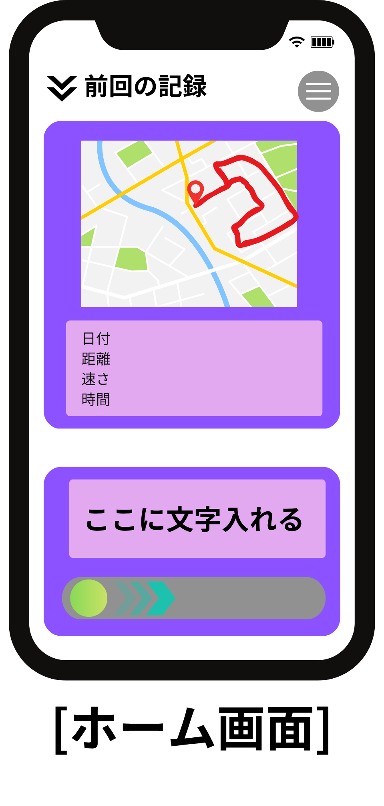

- **画面名**：ホーム（前回記録表示）
- **概要**：地図を背景に、上部に前回記録カード（初回は「-」表示）を表示するメイン画面。2回目以降の起動時は、アプリ起動後ここに直接遷移する
- **仕様詳細**：
  - ヘッダーに「前回の記録」とハンバーガーメニュー（設定入口）を配置する
  - 上部カードに、前回ルートの地図プレビューと、日付・距離・速さ・時間を表示する
  - データがない場合は各項目を「-」で示す
  - 前回記録カードをタップすると、ランニング履歴（S10）へ遷移する
  - 下部カードに案内テキストと、スワイプ操作によるラン開始導線を置く
  - ラン開始のスライドボタンは、一定のしきい値を超えてスライドしていれば、指を離しても自動的に最後まで進みランを開始する。しきい値未満なら元の位置に戻り、キャンセル扱いとする
  - ラン開始操作後はデバイス接続（S4）へ進む
- **対応する要件定義書の項目**：4.2 ホーム画面（前回記録表示）

<a id="screen-s4"></a>

### S4 デバイス接続

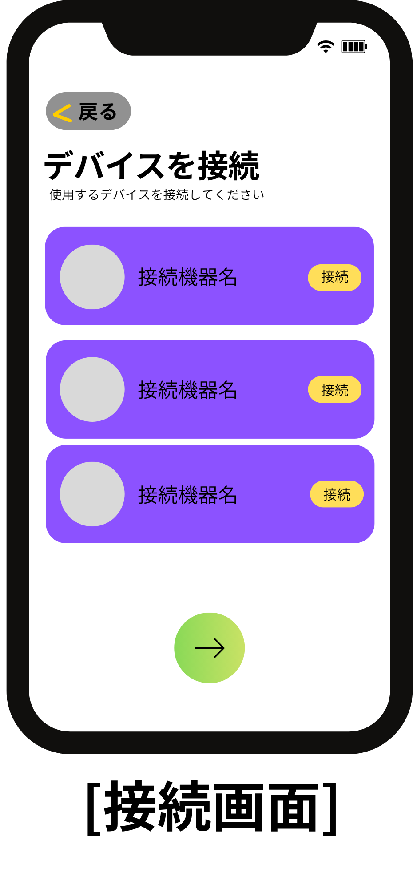

- **画面名**：デバイス接続
- **概要**：ARグラス・Apple Watch・AirPodsの接続状況を管理する画面。ホームからラン開始操作をするたびに表示する
- **仕様詳細**：
  - タイトル「デバイスを接続」、説明「使用するデバイスを接続してください」
  - デバイス行を一覧表示し、各行に接続操作（「接続」）を置く
  - 必須（ARグラス）／任意（Apple Watch・AirPods）は視覚的に区別する
  - ARグラス（必須）の接続に失敗した場合：エラー表示し、再接続を促す。先には進めない
  - Apple Watch・AirPods（任意）の接続に失敗した場合：エラー表示はするが、そのまま先に進める
  - 「戻る」でホーム（S3）側へ戻れる
  - 下部の進むボタンでランニング設定（S5）へ進む
- **関連仕様**：[権限管理・フォールバック](#detail-permission)
- **対応する要件定義書の項目**：4.2 Readyチェック機能（デバイス接続）

<a id="screen-s5"></a>

### S5 ランニング設定

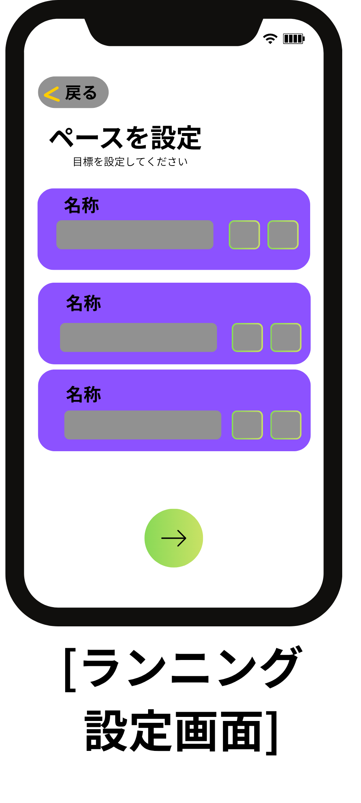

- **画面名**：ランニング設定
- **概要**：時間・距離・ペースの3値を設定する画面。ドラムロール・+/-ボタン・直接入力の3方式で編集可能
- **仕様詳細**：
  - タイトル「ペースを設定」、説明「目標を設定してください」
  - 時間・距離・ペースをカード形式で並べ、直接入力欄と微調整（+/-）を提供する
  - 3値は相互依存。距離は基本的に自動修正の対象としない
  - 「戻る」で前画面（S4）へ戻る。進む操作でルート提案（S8）へ遷移する
  - 時間・距離・ペースを変更した後に「戻る」でS4へ戻った場合、変更した値は破棄され、次回S5に来たときは前回の確定値に戻る
  - 詳細な自動更新ルールは [4.1 自動計算ロジック](#detail-auto-calc) を参照
- **対応する要件定義書の項目**：4.2 ランニング設定（ハイブリッド入力）
- **詳細仕様**：[4.1 自動計算ロジック](#detail-auto-calc)

<a id="screen-s8"></a>

### S8 ルート提案

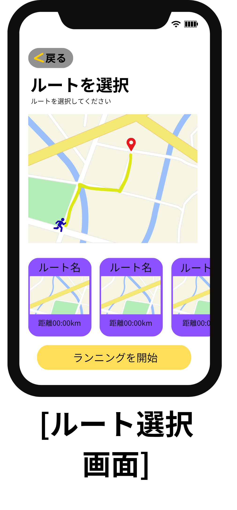

- **画面名**：ルート提案
- **概要**：おすすめルート・過去に走ったルートを候補として複数提示する画面（S5の目標距離に近い順）
- **仕様詳細**：
  - タイトル「ルートを選択」、説明「ルートを選択してください」
  - 画面上部：現在選択中のルートを表示するマップ。画面下部：候補カードを横スクロールで一覧表示（おすすめルート・過去のルート、目標距離に近い順）
  - カードをタップ：そのルートを選択し、上部マップのプレビューを更新する（この時点ではポップアップは出ない）
  - カード内の「詳細を見る」をタップ：ポップアップでルート全体像・距離・推定時間・ペースを表示する
  - ポップアップを閉じても選択は解除されず、直前に選んだ候補のまま維持する
  - 候補が1件もない場合：デフォルトのルート（直線距離等）を自動生成して提示する
  - 好みに合わない場合は、地図上で終了地点を選んでルート自動算出できる（カーナビ的操作）
  - 候補を選んだ（または調整した）後に「戻る」でS5へ戻った場合、選んでいたルートは破棄される。次回S8に来たときは最初の候補選択状態からやり直す
  - 「ランニングを開始」で走行中ロック（S6）へ進む。カスタマイズは S8-1 へ
  - 詳細は [4.2 ルート提案の詳細](#detail-route) を参照
- **対応する要件定義書の項目**：4.2 ルート提案
- **詳細仕様**：[4.2 ルート提案の詳細](#detail-route)

<a id="screen-s8-1"></a>

### S8-1 ルートカスタマイズ

- **画面名**：ルートカスタマイズ
- **概要**：ユーザーが地図上でルートを自分で詳細に指定する画面
- **仕様詳細**：
  - S8の「カスタマイズ」から遷移する
  - 地図上で経路を詳細に指定する
  - ルートを作成し終えると、作成と同時にそのまま S6（ランニング中）へ進む（S8への確定ボタンは経由しない）
  - 作成中のルートが非現実的（例：100km超や道路でない場所を通る）な場合：エラー表示し、修正を促す（保存不可）
- **対応する要件定義書の項目**：4.2 ルート提案
- **関連仕様**：[4.2 ルート提案の詳細](#detail-route)

<a id="screen-s6"></a>

### S6 ランニング中（ロック画面）

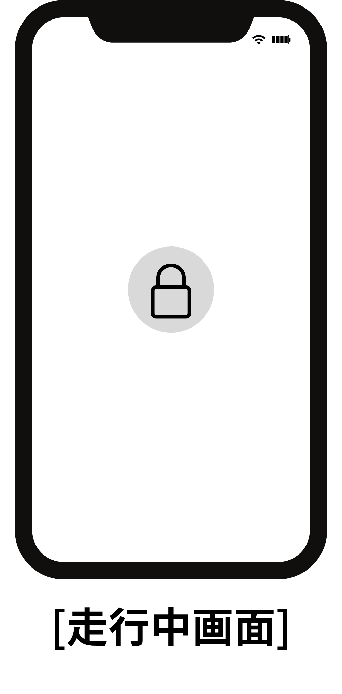

- **画面名**：ランニング中（ロック画面）
- **概要**：走行中の誤操作を防ぐガードレイヤー画面。自動スリープを無効化しつつ、誤操作を防ぐ
- **仕様詳細**：
  - 走行開始後に表示する。画面中央にロックアイコンを置き、誤タップを防ぐ
  - 走行中は自動スリープを無効化する
  - 画面操作の主体はARグラス側HUDを想定し、スマホはガード状態を維持する
  - 走行中にGPS信号が一時的に途絶えた場合：ガイドを表示しつつ、ラン自体は継続する（GPS復帰を待つ）
  - ロック画面をスワイプで解除しても、一時的な確認用でありランは継続する（解除だけではランは終了しない）
  - ランを終了させるには、ロック解除後に長押しなど別のジェスチャーが必要
  - 走行終了操作後にラン結果（S7）へ遷移する
- **対応する要件定義書の項目**：4.2 誤操作防止・スリープ制御

<a id="screen-s7"></a>

### S7 ラン結果

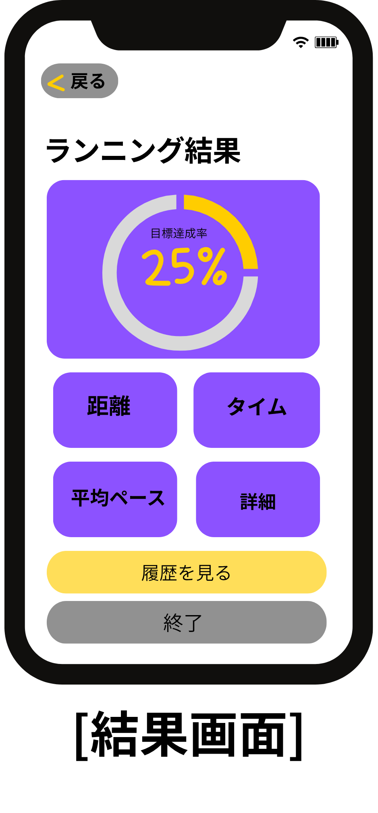

- **画面名**：ラン結果
- **概要**：走行後の記録を表示する画面。ランク（シンクロ率%）・バッジ・コメント、距離、タイム、平均ペース、疲労度などを表示する
- **仕様詳細**：
  - タイトル「ランニング結果」
  - 上部に目標達成率（シンクロ率を基にした達成表示）を円形インジケータで示す
  - 中央に距離・タイム・平均ペース・詳細への入口を配置する
  - 「詳細」側に、メイン表示に含めない項目（消費カロリー等）や疲労度を格納する
  - 「履歴を見る」でランニング履歴（S10）へ、「終了」でホーム（S3）へ戻る
- **対応する要件定義書の項目**：4.1 リザルト・スコアリング／身体負荷・疲労推定／4.2 走行終了後の画面遷移

<a id="screen-s9"></a>

### S9 設定メニュー

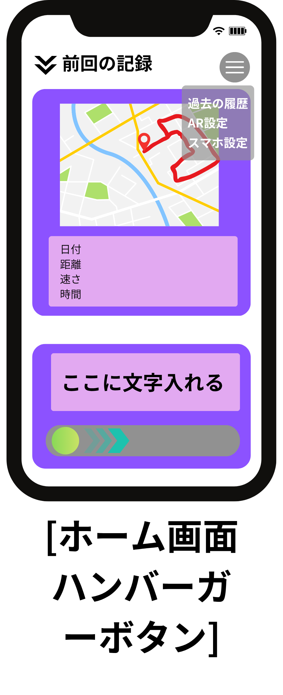

- **画面名**：設定メニュー
- **概要**：ホーム画面（S3）のハンバーガーメニューからアクセスする設定一覧
- **仕様詳細**：
  - ホーム右上のハンバーガーボタンを押すと、メニューが展開する
  - モック上の項目例：過去の履歴／AR設定／スマホ設定
  - 「過去の履歴」→ S10、「AR設定」→ S9-3、「スマホ設定」→ スマホ操作設定画面
  - 要件定義上の入口として、オンボーディング見返し（S9-1）・身体情報の再設定（S9-2）も設定系統から辿れる想定
- **対応する要件定義書の項目**：4.2 設定メニュー

<a id="screen-phone-settings"></a>

### スマホ設定（設定メニュー内）

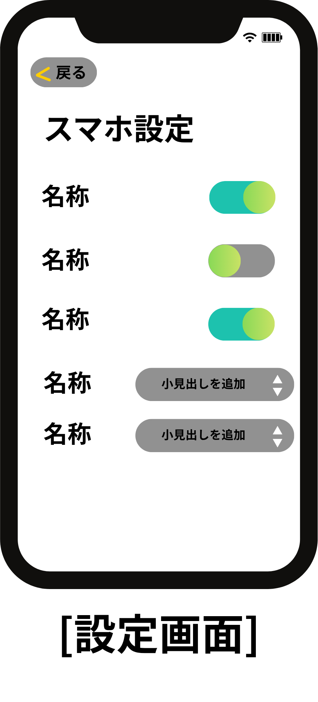

- **画面名**：スマホ設定
- **概要**：ハンバーガーメニューの「スマホ設定」から開く、スマホ側操作・表示に関する設定画面
- **仕様詳細**：
  - タイトル「スマホ設定」。上部に「戻る」
  - ON/OFFトグルと、選択式の項目（小見出し追加など）を一覧で扱う
  - 設定変更後は「戻る」で前画面（ホームまたは設定入口）へ戻る
- **補足**：専用の画面IDは未採番。設定メニュー（S9）配下の画面として扱う

<a id="screen-s9-1"></a>

### S9-1 オンボーディング見返し

- **画面名**：オンボーディング見返し
- **概要**：S1のオンボーディングを再度閲覧できる画面
- **仕様詳細**：設定メニューからアクセスし、初回導入コンテンツを再表示する
- **対応する要件定義書の項目**：4.2 設定メニュー

<a id="screen-s9-2"></a>

### S9-2 身体情報の再設定

- **画面名**：身体情報の再設定
- **概要**：S1'で入力した身長・体重・性別を再設定する画面
- **仕様詳細**：
  - 設定メニューからアクセスし、身体情報を更新する
  - 入力途中に「戻る」を押した場合：入力内容は破棄され、元の値に戻る
- **対応する要件定義書の項目**：4.2 設定メニュー

<a id="screen-s9-3"></a>

### S9-3 ARグラス表示設定

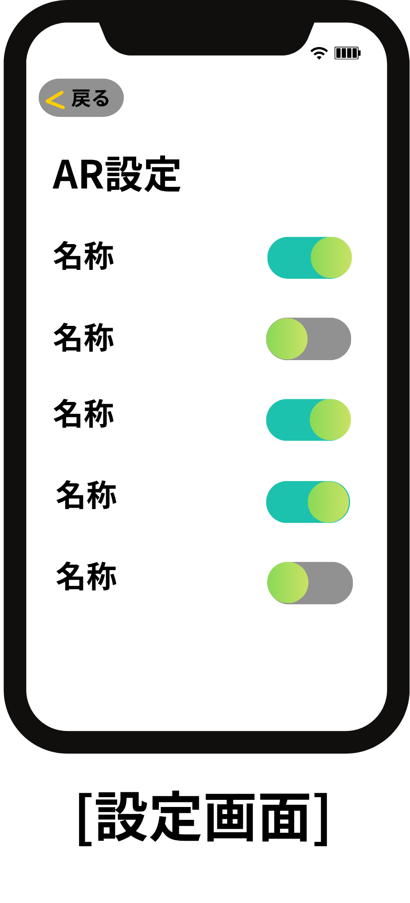

- **画面名**：ARグラス表示設定
- **概要**：HUD表示項目（ペース・心拍数など）のON/OFF、走行分析結果の表示可否を設定する画面
- **仕様詳細**：
  - タイトル「AR設定」。上部に「戻る」
  - HUD／分析表示の各項目をトグル（ON/OFF）で切り替える
  - トグルを操作した瞬間に即時反映する（確定ボタンなし）
  - 変更内容はARグラス側の表示に反映する
- **対応する要件定義書の項目**：4.2 設定メニュー

<a id="screen-s10"></a>

### S10 ランニング履歴

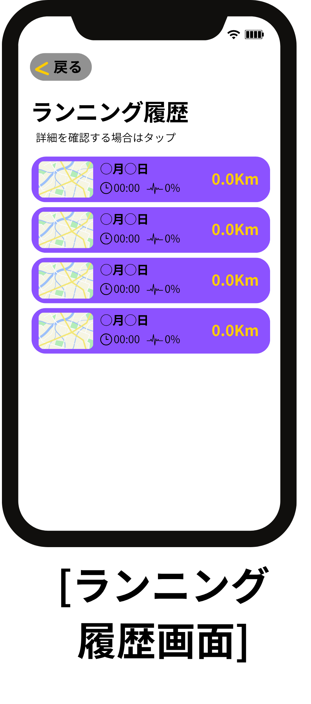

- **画面名**：ランニング履歴
- **概要**：過去の走行履歴を一覧で表示・削除できる画面。走行データはアプリ内に保存し、外部サービス連携は行わない
- **仕様詳細**：
  - タイトル「ランニング履歴」、説明「詳細を確認する場合はタップ」
  - 各行に地図サムネ・日付・時間・シンクロ率・距離を表示する
  - 各カードを左スワイプすると削除ボタンが現れる
  - 削除ボタンを押すと、「本当に削除しますか？」の確認ポップアップを表示する
  - 確認ポップアップで確定した場合のみ削除を実行する
  - ホームの前回記録カード、結果画面の「履歴を見る」、設定メニューの「過去の履歴」から到達する
  - 「戻る」で元の画面へ戻る

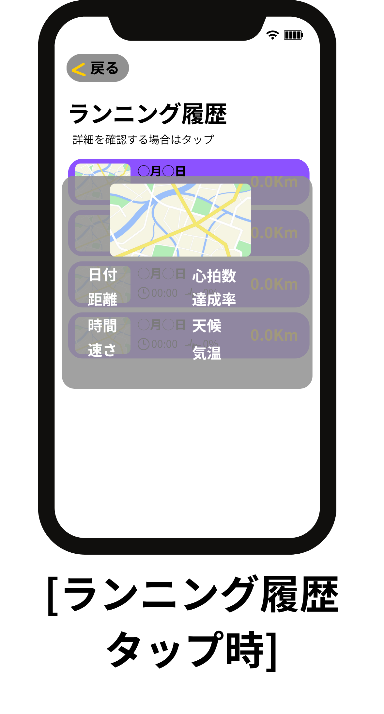

- **仕様詳細（履歴タップ時）**：
  - 一覧のカードをタップすると、詳細ポップアップを前面に表示する
  - 詳細にはルート地図、日付、距離、時間、速さ、心拍数、達成率、天候、気温などを含む
  - 背景の一覧は暗転し、詳細確認に集中できる表示とする
- **対応する要件定義書の項目**：4.1 走行履歴の保存・閲覧

---

## 3. 画面遷移フロー（概要）

### 3.0 参考：実装側の画面遷移図

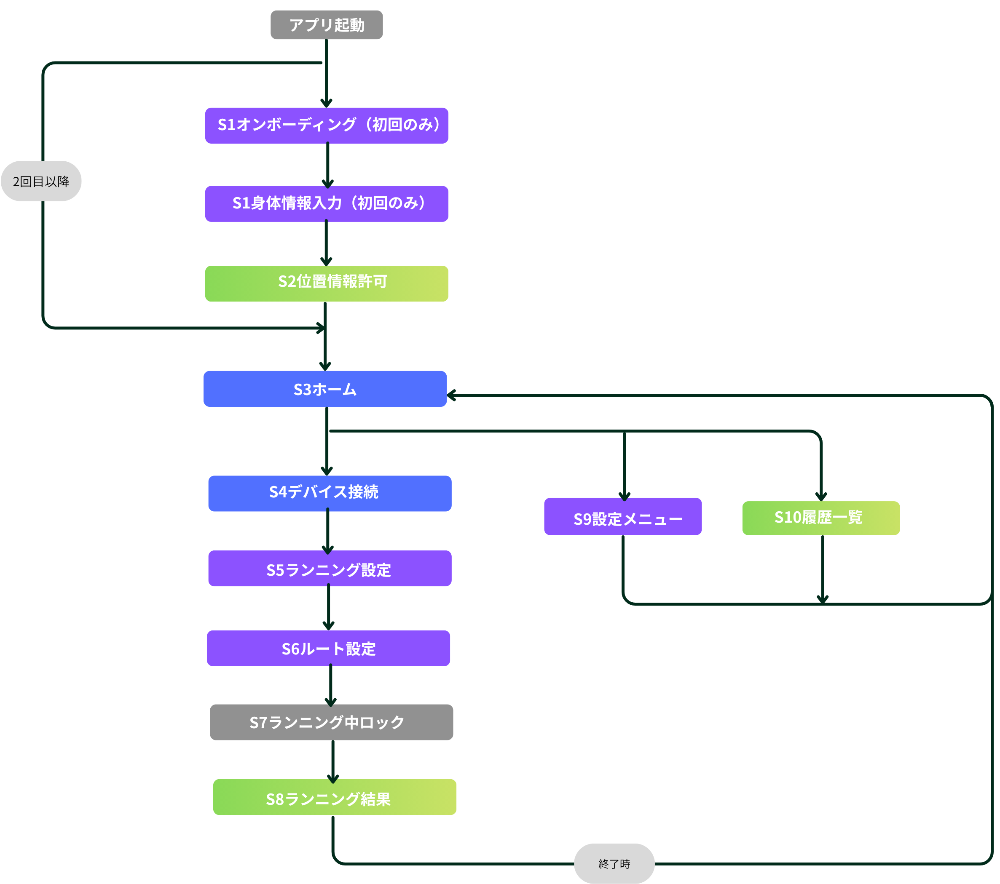

実装側の画面遷移図。画面ID（S1〜S10）および遷移順の参照とする。

### 3.1 起動時の分岐

```
アプリ起動
  ├─ 初回起動 ──────→ S1 オンボーディング → S1' 身体情報入力 → S2 位置情報許可 → S3 ホーム
  └─ 2回目以降の起動 ─→ S3 ホーム（S1・S1'・S2をすべてスキップ）
```

### 3.2 メインフロー

| 画面 | 操作 | 遷移先 |
|---|---|---|
| S3 ホーム | 前回記録カードをタップ | S10 ランニング履歴 |
| S3 ホーム | ☰メニュー | S9 設定メニュー |
| S9 設定メニュー | オンボーディング見返し | S9-1 |
| S9 設定メニュー | 身体情報の再設定 | S9-2 |
| S9 設定メニュー | ARグラス表示設定 | S9-3 |
| S9 設定メニュー | 履歴の確認 | S10 ランニング履歴 |
| S3 ホーム | ラン開始操作 | S4 デバイス接続 |
| S4 デバイス接続 | （進む） | S5 ランニング設定 |
| S5 ランニング設定 | （進む） | S8 ルート提案 |
| S8 ルート提案 | カスタマイズ | S8-1 ルートカスタマイズ |
| S8-1 ルートカスタマイズ | ルート作成完了 | S6 ランニング中 |
| S8 ルート提案 | ランを開始 | S6 ランニング中 |
| S6 ランニング中 | 走行終了操作 | S7 ラン結果 |
| S7 ラン結果 | 履歴を見る | S10 ランニング履歴 |
| S7 ラン結果 | 終了 | S3 ホームへ戻る |

※ S4・S5・S8（デバイス接続・ランニング設定・ルート提案）は、ホームからラン開始操作をするたびに毎回表示する。

---

## 4. 画面別 仕様詳細

<a id="detail-auto-calc"></a>

### 4.1 S5 ランニング設定：自動計算ロジック

時間・距離・ペースの3値は相互に依存する関係にあり（例：ペース＝時間÷距離）、3値とも自由に編集できる。編集時の自動更新ルールは以下の通り。

画面概要は [S5 ランニング設定](#screen-s5) を参照。

**自動更新の優先順位**

距離は誤入力が考えにくいため、基本的に自動修正の対象としない。

| ユーザーが直近に編集した項目 | 自動更新される項目 |
|---|---|
| 距離のみ | ペース |
| 時間のみ | ペース |
| ペースのみ | 時間 |
| ペース → 時間（両方を続けて編集） | 距離 |

**更新タイミング**

- **通常時（自動更新の結果が有効な値の場合）**：ポップアップなしで即座に反映する
- **無効な値になる場合**（0除算・非現実的な数値など）：ポップアップで通知したうえで、直前の有効な値に自動的に戻す

**キャンセル時の扱い**

- 時間・距離・ペースを変更した後に「戻る」でS4へ戻った場合、変更した値は破棄され、次回S5に来たときは前回の確定値に戻る

---

<a id="detail-route"></a>

### 4.2 S8 ルート提案：詳細仕様

画面概要は [S8 ルート提案](#screen-s8) ／ [S8-1 ルートカスタマイズ](#screen-s8-1) を参照。

**候補の提示**

- 画面上部に現在選択中のルートマップ、画面下部に候補カードを横スクロールで一覧表示する
- おすすめルート・過去に走ったルートを候補として複数提示する
- 候補は、S5で設定した目標距離に近い順に並べる
- 候補が1件もない場合は、デフォルトのルート（直線距離等）を自動生成して提示する

**選択とポップアップ**

- カードをタップ：そのルートを選択し、上部マップのプレビューを更新する（この時点ではポップアップは出ない）
- カード内の「詳細を見る」をタップ：ポップアップでルート全体像（地図）・距離・推定時間・ペースを表示する
- ポップアップを閉じても選択は解除されず、直前に選んだ候補のまま維持する

**候補がない／好みに合わない場合の代替手段**

- 地図上で終了地点を選択すると、ルートを自動算出する（カーナビのような操作感）

**キャンセル時の扱い**

- 候補を選んだ（または調整した）後に「戻る」でS5へ戻った場合、選んでいたルートは破棄される
- 次回S8に来たときは、最初の候補選択状態からやり直す

**ルートカスタマイズ（S8-1）**

- 「カスタマイズ」ボタンから S8-1 へ遷移し、ユーザー自身が地図上でルートを詳細に指定できる
- ルート作成完了と同時に S6（ランニング中）へ進む（S8への確定ボタンは経由しない）
- 作成中のルートが非現実的（例：100km超や道路でない場所を通る）な場合はエラー表示し、修正を促す（保存不可）

---

<a id="detail-safety"></a>

### 4.3 セーフティ・ロギング

急停止・速度超過・逸脱地点をルートマップ上にログとして記録する（画面IDなし。走行分析・データマネジメント要件）。

---

<a id="detail-permission"></a>

### 4.4 権限管理・フォールバック

[S2 位置情報許可の訴求](#screen-s2) ／ [S4 デバイス接続](#screen-s4) および出走前後の権限確認に関連する。

- **カメラ権限拒否時**：アバター表示を停止し、HUD（数値）モードのみで走行計測を継続する
- **位置情報（GPS）**：S2では拒否しても先に進める。実際にGPSが必要になるタイミング（S8ルート提案、S6ランニング中など）で未許可のままだと、その機能に到達した時点で案内を表示し、オンにするまでその機能は使えない
- **必須権限（BT等）拒否時**：出走不可とし、OS設定画面への誘導を表示する

---

## 5. 改訂履歴

| バージョン | 日付 | 変更内容 |
|---|---|---|
| v2（更新） | 2026-09-07 | 各画面の確認・エラー・キャンセル・中断時の挙動を追加。S8の選択／ポップアップ仕様、S8-1完了後のS6直行、S10削除確認、権限の段階的案内などを反映。「使用詳細」を「仕様詳細」に統一 |
| v2 | 2026-09-05 | v1の内容（画面ID・画面遷移・S5自動計算ロジック・S8ルート提案仕様など）を引き継ぎ、v2として新規作成。文書先頭に機能一覧を組み込み、各画面見出しへのリンクを追加。v1までの詳細な更新履歴は スマホアプリ側_基本設計書_v1.md を参照 |
