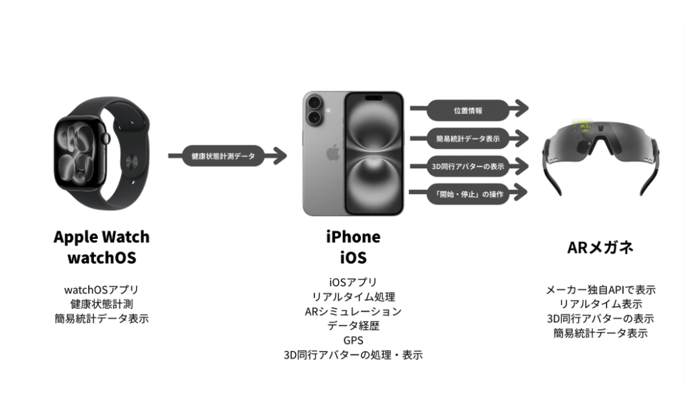
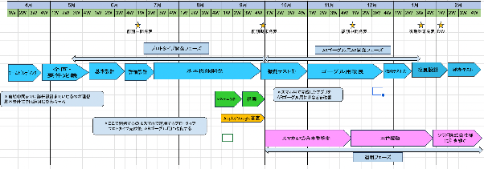
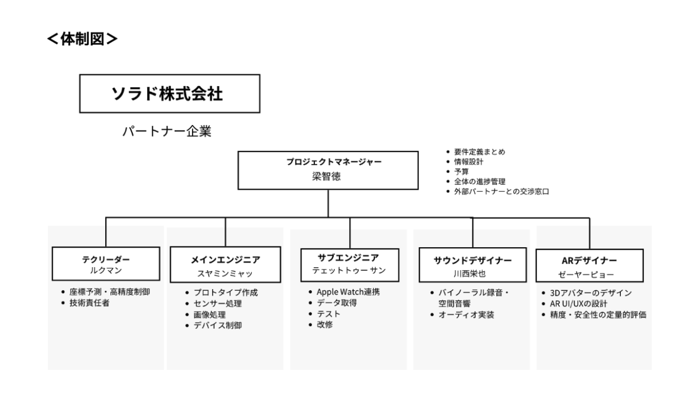

### **1. プロジェクト名**

**次世代ARランニング支援システム「AR Vision」の開発** 

〜計算幾何学による高精度なペーシング体験の実現〜

**【本プロジェクトの技術・市場妥当性について】** 

本企画書の内容は、最新の市場データおよび生理学的知見に基づいた詳細な調査を経て策定されている。専門的な分析データについては、以下の報告書を併せて参照されたい。 

 [➡︎ **AR Vision 調査報告書：生理学的根拠と市場転換点の分析**]()

### **2. 開発の背景・目的**

#### **■ 開発の背景：現代のランナーが抱える「情報のジレンマ」**

現在、多くのランナーがスマートウォッチやスマホアプリを利用しているが、そこには「情報の認知ラグ」という大きな課題が存在する。

* **視線移動によるフォームの乱れ:** ペースを確認するために腕時計を見る動作は、わずかながら走行フォームを崩し、特に疲労が蓄積した後半戦ではバランスを乱す要因となる。  
* **「数値」と「感覚」の解離:** 「キロ4分30秒」という数値情報を脳内で処理し、それを脚の動き（ピッチやストライド）にフィードバックするプロセスには認知リソースを消費する。この「頭で考えて走る」状態は、ランナーが本来目指すべき「ゾーン（没入状態）」への進入を妨げている。※[調査報告書1.6]()参照  
* **単独走行時の精神的負荷:** 一人で設定ペースを守り続けるには強い自律心が必要であり、精神的な疲労が肉体的な限界よりも先に訪れることが多い。※[調査報告書の1.3 \- 1.4]()参照

#### **■ ターゲットユーザー（ペルソナ）**

ここで、具体的な「大会に出場するアマチュアランナー」の像を提示する。

> **ペルソナ：** 30代の市民ランナー。年に数回フルマラソンの大会に出場し、自己ベスト更新を目標にしている。 

> **課題：** 一人でのペース走において、正確なペーシングを維持したいが、疲労時の「計算負荷」と「視線移動」がパフォーマンス低下の要因となっている。**特に「あと15秒上げなければ」という脳内計算のストレスが、肉体的な限界よりも先に心を折る原因となっている。**

> 

#### **■ 目的：視覚的ペーシングによる「ランニングの再定義」**

本プロジェクトは、AR技術を用いることで「数値の確認」を「直感的な追随」へと変換し、以下の目的を達成する。

1. **【フォームの安定化】「前方注視」の維持による安全性と効率性の向上:** 視線を常に前方のコースに固定したまま、アバターの位置関係だけでペースを把握。これにより、周囲の安全確認と理想的なランニングフォームの維持を両立させる。  
2. **【認知リソースの最適化】 認知負荷の最小化（直感的フィードバック）:** 「遅れているからピッチを上げよう」と考える前に、「アバターが離れたから追いかけよう」という本能的な反応を引き出す。脳の処理負荷を下げ、走ることそのものに集中できる環境を提供する。  
3. **【伴走体験の再構築】「競争心」と「共創」の創出:** 無機質な数値ではなく、実在感のあるアバターを投影することで、孤独なトレーニングを「対戦」へと変える。過去の自分（ゴースト）や遠方の友人のデータを投影することで、時間と空間を超えた並走体験を実現する。

※本機能の生理学的根拠（過去の自己との競走による予備力解放）については、[**こちらの調査報告書（1.3節）**]()にて科学的実証データを詳述している。

> 

### **３. 主な機能とユーザー体験（UX）**

* **直感的なペーシング:** キロ何分で走るかを設定すると、デバイス上に3Dアバターが出現。ランナーは数値ではなく「アバターとの距離」を視覚的に捉えるだけでペースを維持できる。  
* **リアルな距離感の変動:**  
  * **遅延時:** 自分のペースが設定より遅い場合、アバターは物理法則に従ってスムーズに離れていく。  
  * **超過時:** 自分のペースが速い場合、アバターを物理的に追い越し、前方から消える（抜き去る快感の提供）。

### 

  * **聴覚フィードバック:** 距離に応じてアバターの「足音」や「呼吸音」が変化。背後から迫る気配や遠ざかる息遣いをリアルに再現することで、視覚情報に頼り切らない没入感のあるペーシングを実現する。  
* **前方注視の維持（安全性・効率性）:** 腕時計をチラチラと見る動作を排除。常に前方を見たまま走行できるため、安全性が向上し、ランニングフォームの乱れも防止。  
* **ゴースト機能への拡張:** 過去の自分の走行データを読み込み、昨日の自分や自己ベストの自分とAR上で競走させる。足音や呼吸までも再現された「過去の自分」と並走することで、単独走行時の精神的負荷を軽減する。

  #### **AR Vision 機能一覧**

  #### **1. アバター・エンジン（表現 ＆ 空間制御）**

* **コア・レンダリング:** 透過率50%の半透明・微発光人型アバター（175cm）およびフェイクシャドウの描画。  
* **先行追従・スムージング:** ユーザーの3.0m前方を維持。GPSとIMUを統合し、20ms以内の超低遅延で滑らかな動きを実現。  
* **自動接地（地面スナップ）:** LiDAR/空間認識APIにより、勾配や段差に関わらずアバターの足を常に物理地面へ固定。  
* **速度連動アニメーション:** Walk/Jog/Runの3段階モーションを、速度変化に合わせて2.0秒でブレンディング。  
* **自律アクション ＆ 状態通知:**  
  * **離隔待機:** 10m以上離れた際に座標を固定し、カラーを琥珀色へ変更して手招きアクションを実行。  
  * **待機・信号待ち:** 停止後1秒以内にアバターが**ユーザー側へ向きを変え（対面）**、足踏みや呼吸動作で待機。  
  * **バイタル警告:** 心拍過負荷時にカラーを深青へ変更し「落ち着け」のハンドサインを再生。  
* **VFX演出:** 起動時の粒子集積、終了時の挨拶と消滅、接地時のサイバーパルス演出。

  #### **2. AR HUD ＆ 視覚インタラクション**

* **周辺視野レイアウト:** 中央視野をクリアに保ち、四隅と下部に心拍数・タイム・距離・ペースを配置。  
* **スタビライズ（防振）:** IMU連動により走行時の振動を相殺。ユーザーが横を向いた際は表示を自動抑制。  
* **アダプティブ表示:** 環境光に応じた輝度調整。1pxアウトラインによる高コントラスト確保。  
* **ダイナミック・フィードバック:** 危険時の赤色点滅、目標達成時の拡大演出、バッテリー10%以下の黄色点滅。

  #### **3. セーフティ ＆ サウンド・システム**

* **特定音声 ＆ 優先度制御:** **「赤信号・交差点」のみ**を音声警告対象とし、重複時はTTC（衝突猶予時間）が短いものを優先。  
* **マルチモーダル通知:** アバターのハンドシグナル、および状況別スマホ振動（信号：長め / エラー：短め）の使い分け。  
* **サウンド・リアリティ:** 路面状況に応じた足音、心拍連動の呼吸音、システム音（カウントダウン/ゴール）。  
* **環境適応音響:** マイク計測により周囲が45dB超で自動音量調整（最大75dB）。  
* **自動ルート復帰:** コース逸脱時、警告せずサイレントにルート再計算を行い、アバターが後方から追走・合流。

  #### **4. 走行分析 ＆ データマネジメント**

* **シンクロ分析エンジン:** 3.0mの追従精度を0〜100%で算出。走行距離に応じたチェックポイント（1km/5km毎）で自動判定。  
* **リザルト・スコアリング:** 平均シンクロ率から4段階ランク（Perfect〜Try Again）を判定。アバターによるコメント生成。  
* **身体負荷・疲労推定:** 気温（28℃/31℃以上）を係数とし、猛暑時は負荷計算を1.5〜2.0倍に自動補正。  
* **セーフティ・ロギング:** 急停止・速度超過・逸脱地点をルートマップ上にログ記録。  
* **デュアル・データ保存:** アプリ内DBおよびApple HealthKitへの自動同期保存。

  #### **5. スマホアプリUI ＆ コネクティビティ**

* **オンボーディング:** 身体情報（身長・体重・性別）の初期入力。  
* **ランニング設定（ハイブリッド入力）:** 前回の記録をベースに、以下の3方式を統合した柔軟な目標設定。  
  * **ドラムロール:** スワイプで直感的に数値を変更。  
  * **\+/-ボタン:** 最小単位での微調整。  
  * **直接入力:** 数値部分をタップして**キーボードから「10.55km」などの任意数値を直接入力**。  
* **Readyチェック機能:** スマホ・グラス（必須）、Watch・イヤホン（任意）の接続状況を4色インジケーターで管理。  
* **誤操作防止・スリープ制御:** 走行開始ボタン押下後、**自動スリープを無効化**しつつ、誤操作を防ぐ「ガードレイヤー」を表示。  
* **権限管理 ＆ フォールバック:**  
  * **カメラ権限拒否時:** アバター表示を停止し、「HUD（数値）モード」のみで走行計測を継続。  
  * **必須権限（GPS/BT）拒否時:** 出走不可とし、OS設定画面への誘導を表示。

### **4. システムアーキテクチャ（開発の技術的裏付け）**

##### **Swift × C++ のハイブリッド構成**

* **Swift:** Watch-iPhone間のリアルタイム通信、ARKit/RealityKitを用いた空間描画、UI実装を担当。  
* **C++:** 高度な計算幾何学や、カルマンフィルタを用いた座標予測ロジックなど、Swift単体ではパフォーマンスの最適化が困難な核心部分のみに使用。  
* **開発指針:** 開発スピードと保守性を優先し、可能な限りSwiftでの実装を基本とする。C++は、ハードウェアの限界性能を引き出す必要があるボトルネック箇所への「特化エンジン」として最小限の適用に留める。

  ##### **デバイス役割と連携**

* **Apple Watch（計測）:** 高精度な心拍、ピッチ、加速度データの取得。  
* **iPhone（演算・通信・計測）:** メインプロセッサとして、Watchからのデータ受信、アバターの座標計算、ARグラスへの映像出力制御、加速度データの取得を担当。  
* **ARグラス（表示）:** ランナーの視界を遮らない透過型ディスプレイによる、アバターおよび最小限の情報の投影。

### **5. コスト**

本プロジェクトのプロトタイプ開発および実証実験にあたり、以下の通り機材調達を計画しています。限られた予算内で、開発に不可欠なARデバイス一式を揃えます。

**予算総額：¥50,000**

| 項目 | 具体的な内容 | 予定価格（税込） | 備考 |
| :---- | :---- | :---- | :---- |
|  **ARグラス** |  XREAL One（中古品） |  ¥35,980 |  描画エンジン・センサー制御用 |
|  **外部カメラ** |  XREAL Eye |  ¥13,980 |  XREAL One対応、空間認識・トラッキング用 |
|  **合計** |  |  **¥49,960** |  **残金：¥40** |

### 

### **6.プロジェクトの到達目標（成功の定義）**

本プロジェクトは、1年という限られた開発期間において最大の成果を出すため、第1期（2026年度）のゴールを「陸上トラック（制御された環境）におけるARペーシング技術の完全確立」と定義する。以下の3つの基準をすべて満たすことをもって、本プロジェクトの成功とみなす。

#### **① 技術的成功基準（アルゴリズムの完成度）**

* コーナー追従の安定性: 400mトラックの曲線部において、アバターが接線方向（進行方向）を正確に維持し、不自然な挙動やワープを発生させずに旋回し続けること。  
* 低遅延描画の死守: ユーザーの動きからAR表示への反映（Motion-to-Photon）において、目標値である20ms以内を95%以上の動作時間で維持すること。  
* 接地精度の担保: LiDARおよび空間認識により、段差や路面の傾斜に関わらず、アバターの足元を物理地面に正確に固定すること。

#### **② UX的成功基準（没入感と安全性の達成度）**

* 視覚的安定性の確保: 1.5秒の移動平均フィルタを適用し、ユーザーの首振りに影響されない「独立した進行方向」にアバターを配置することで、VR酔いを防止しつつ前方注視を促すこと。  
* 直感的なペーシング: GPS計測値とトラックの既知距離を照合し、ランナーがアバターとの距離感だけで正確にペースを把握できる信頼性を担保すること。

#### **③ 社会実装・継承基準（プロジェクト完遂定義）**

* 実証実験の完遂: 陸上競技場において、スタートからゴール、そしてクールダウンまでの一連のシークエンスを、システムダウンなしに完遂すること。  
* 技術資産の譲渡: 開発されたソースコード、および核心的アルゴリズムが、ソラド株式会社において「再現・拡張可能」な状態で引継ぎ完了されること。

### 

### **7. スケジュール（予定管理）**

上記「成功の定義」を確実に達成するため、以下の通り段階的な開発・検証プロセスを計画する。

 **＜簡単図＞**

****

### **8. チーム内役割**

本プロジェクトは、各分野の専門性を最大化させた以下の6名体制で推進する。

* **プロジェクトマネージャー (PM) / 統括・外部交渉**  
  * **役割:** 全体の進捗管理、予算・リソース管理、および外部パートナー（ソラド社等）との交渉窓口。  
  * **ミッション:** チームが開発に集中できる環境を構築し、ステークホルダーとの認識齟齬を排除することで、プロジェクトの着実な完遂を保証する。  
* **テクリーダー / 最先端ロジック**  
  * **役割:** 計算幾何学に基づく座標予測エンジン、およびカルマンフィルタを用いた高精度フィルタリングの実装及び、技術責任者。  
  * **ミッション:** ハードウェアの限界を超え、「アバターが一切カクつかない」という本プロジェクトの技術的信頼性の核心を担う。  
* **メインエンジニア（Swift）**  
  * **役割:** ARKit/RealityKitを用いた空間描画、およびiPhone側のメインアプリケーションロジックの実装。  
  * **ミッション:** テックリーダーのロジックをAR空間に統合し、安定したアプリケーション基盤を構築する。  
* **サブエンジニア / Watch連携（Swift）**  
  * **役割:** Apple Watchからのバイタル/運動データのリアルタイム取得、およびデバイス間通信の最適化。  
  * **ミッション:** 計測データの低遅延転送を実現し、システムのフィードバック精度を支える。  
* **サウンドデザイナー / 多感覚没入設計（音響）**  
  * **役割:** バイノーラル録音・空間音響技術を用いた「足音・呼吸音」の制作およびオーディオエンジンの実装。  
  * **ミッション:** 視覚情報に「聴覚の実在感」を加え、ランナーをゾーンへと誘う圧倒的な没入感（プレゼンス）を創出する。  
* **ARデザイナー 兼 QA / 視覚演出・実走検証**  
  * **役割:** 3Dアバターのデザイン、AR UI/UXの設計、および実走テストによる精度・安全性の定量的評価。  
  * **ミッション:** 実際に走り込みながら「ランナー視点での正解」を追求し、デザインの審美性と検証データに基づいた品質担保を両立させる。

**＜体制図＞**

### **9. コミュニケーション管理**

* **内部コミュニケーション:** **Google Chat** を使用。日々の細かな進捗報告、相談、意思決定をリアルタイムで行う。  
* **外部連携（ソラド株式会社）:** **Microsoft Teams** を使用。先方担当者との定例会議、公式な仕様確認、Q\&Aを管理。  
* **タスク・進捗管理:** **Jira** を使用。機能単位でチケットを発行し、カンバン方式で開発状況（ToDo / In Progress / Done）を可視化。  
* **ソースコード管理:** **GitHub** を使用。プルリクエストベースのコードレビューを行い、品質の均一化を図る。

### **10. 品質管理**

ユーザーの安全と「没入感」を担保するため、以下の3段階で品質を管理する。

1. **コードレベルの品質（Unit Test）:** GitHub上でのCI連携および相互コードレビューにより、ロジックの正確性を担保する。  
2. **シミュレーション検証:** 開発環境上で、様々な走行データを入力し、アバターの座標計算に異常値が出ないかを確認する。  
3. **実地フィールドテスト（QA）:** ARデザイナー兼QA担当による実走テスト。GPS精度が不安定な場所（ビル影等）での挙動、およびARグラス着用時の視認性・安全性を定量的に評価し、スプレッドシートの「品質管理表」に記録する。

### **11. リスク管理**

プロジェクトの遅延や失敗を防ぐため、以下のリスクを想定し、事前に対策を講じる。

* **技術的リスク（GPS精度の限界）:** GPS誤差によりアバターが不自然な動きをする可能性。 *対策:* C++エンジン側で加速度センサー等を用いた補完ロジック（デッドレコニング）を実装し、挙動を平滑化する。  
* **連携リスク（外部仕様変更）:** デバイスやAPIの仕様変更による手戻り。 *対策:* Teamsでの定例連絡を密にし、仕様変更の兆候を早期に察知。モジュール化された設計により、影響範囲を最小限に抑える。  
* **安全上のリスク（前方不注意）:** AR表示に集中しすぎることで周囲の危険を察知できなくなる可能性。 *対策:* AR UIの透過率を最適化し、一定以上の急制動や障害物接近を検知した際の警告表示機能を検討する。

### **12. 事業の継続性と社会実装体制（サステナビリティ）**

本プロジェクトは、学生チーム独自の機動力と、パートナー企業の安定性を掛け合わせた「ハイブリッド体制」により、一過性の開発に終わらない持続的な社会実装を実現する。

**■ 産学連携による「攻めと守り」の役割分担**

* **技術創出（T\_ KANNAGI）**: 学生チームとしての機動力を活かし、既存の枠組みに捉われない大胆な技術検証（R\&D）をアジャイルに推進。企業内R\&Dでは到達困難なスピード感でプロトタイプを開発する。  
* **事業運用（ソラド株式会社）**: T\_ KANNAGIが創出した革新的技術を精査・継承し、同社の堅牢なインフラと品質管理基盤に乗せて社会に定着させる。

**■ 戦略的IP（知的財産）の継承と市場価値** 

開発される「分散処理アルゴリズム」や蓄積される「走行データ」は、単なる成果物ではなく、ソラド社が継承すべき「戦略的IP」として定義する。これは、米Peloton社によるGhost Pacer社の買収事例に見られるように、フィットネス市場において極めて高い市場価値と参入障壁（MOAT）を形成するものである。

**■ 結論：神戸発イノベーションの永続性** 

経済産業省の「オープンイノベーション指針」に準拠したこの「技術移転モデル」を採用することで、プロジェクト終了後もサービスが途絶えることなく、神戸市におけるスポーツDXの先駆的事例として永続的に発展させる体制を構築済みである。

 ※本体制の詳細なリスク分析および市場妥当性については、[**こちらの調査報告書（第4章）**](#第4章：将来の拡張性)にて詳述している。

### **13. 参考資料・データ出典** 

本プロジェクトの立案にあたり調査した資料は以下の通り。詳細は (株)KANNAGI が作成した「調査報告書」に集約している。ここでは**中核となる出典**のみ記載する。

* [**AR Vision 調査報告書：生理学的根拠と市場転換点の分析（2026年度版）**](https://docs.google.com/document/d/1MUMgqE0-YRQYRxMyNTYC4Vr6AgmtA96AlurRsVMHQ_0/edit?tab=t.nqv5dmnh5mfk) （※以下、本報告書の主要な根拠データ出典）  
* [**矢野経済研究所（2025年8月）**](https://www.yano.co.jp/press-release/show/press_id/3853)：国内XR（VR/AR/MR）市場に関する調査  
* [**Jo Corbett, et al. (2012)**](https://pubmed.ncbi.nlm.nih.gov/21900846/)：ARアバター伴走における生理学的エビデンス  
* [**総務省（令和7年版）**](https://www.soumu.go.jp/johotsusintokei/whitepaper/index.html)：情報通信白書（XR・AIの普及予測）

### 

### **14. 謝辞** 

### 本プロジェクトの始動にあたり、多大なるご支援をいただいておりますソラド株式会社の皆様に、心より感謝申し上げます。

プロジェクトが動き出したばかりの現段階から、私たちの卒業後の事業継続や引き継ぎについても親身に相談に乗っていただき、多方面にわたるバックアップを約束してくださっていることは、チームにとって何よりの励みとなっております。

皆様からいただいた貴重なアイデアと、将来を見据えた温かいご支援を糧に、本プロジェクトを必ずや成功させるべく邁進してまいります。この場を借りて、深く御礼申し上げます。

> > > > > > 

> > > > > > 2026年4月26日 

> > > > > > T\_ KANNAGI 「AR Vision」プロジェクトチーム一同

### 

###
